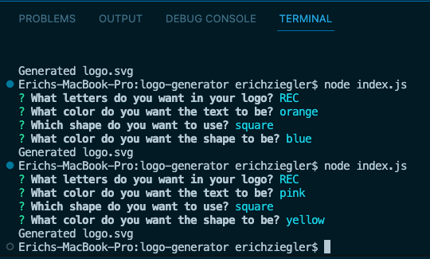
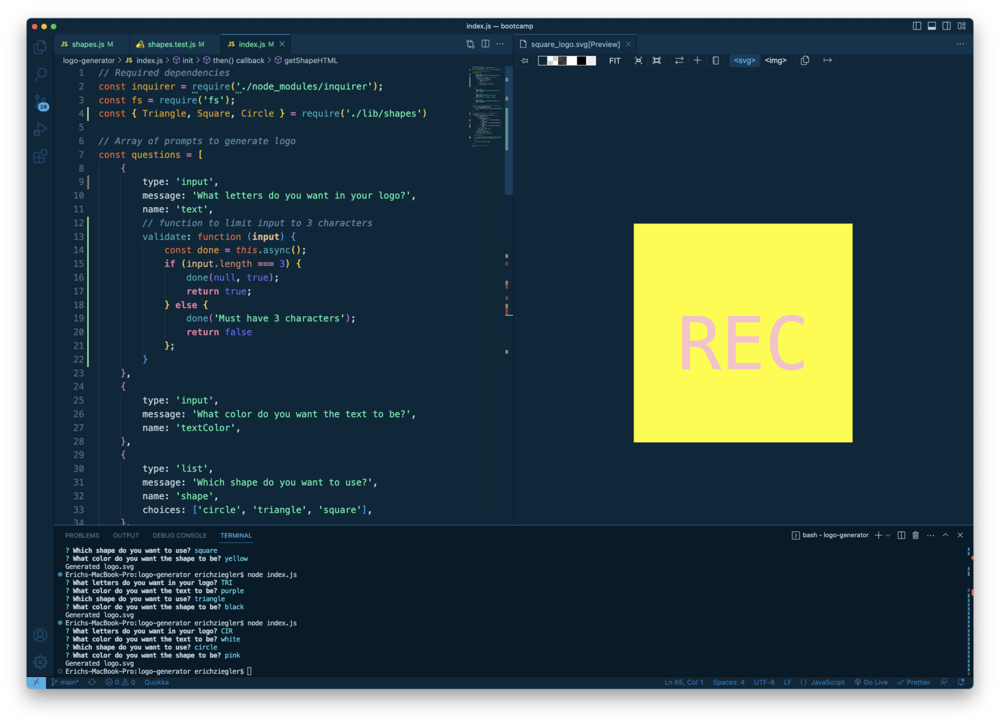
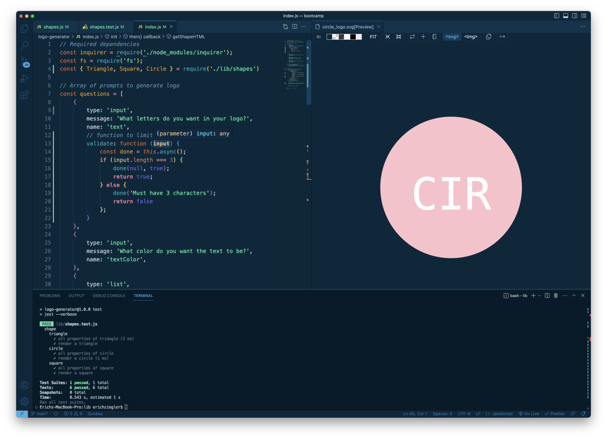

# User Generated Logo Creator (.svg file)

## Description

I was motivated to create this project as a need to be cost efficient and self sufficient, when it comes to creating a logo. I built this because I wanted a quick and interactive way to develop a logo, without needing the use of a graphic designer or multiple resources. It's a one stop shop. It solves the problem of being able to create multiple logo files with hardly any effort, so you can really find the logo that works for you. I learned a ton about using defining and using classes, inheritance, testing with Jest, and importing + exporting between different JS files.

## Installation

The steps to install my project are as follows:

- Clone or fork my code from GitHub
- Install the required dependencies (Inquirer & Jest (for testing))
- Run the file from the command line using "node index.js"

## Usage

Here is a link to a video of the file running:

[Video Link](https://drive.google.com/file/d/1m4lgAym4SVdwRyNXfQoPTLx9FFFer0ye/view)

Here is an example of the of the prompts in the app:

Here is an example of the logo produced after running the app:

Here is an example of passed tests using Jest:

## License

MIT License

Copyright (c) 2023 Erich Z.

Permission is hereby granted, free of charge, to any person obtaining a copy of this software and associated documentation files (the "Software"), to deal in the Software without restriction, including without limitation the rights to use, copy, modify, merge, publish, distribute, sublicense, and/or sell copies of the Software, and to permit persons to whom the Software is furnished to do so, subject to the following conditions:

The above copyright notice and this permission notice shall be included in all copies or substantial portions of the Software.

THE SOFTWARE IS PROVIDED "AS IS", WITHOUT WARRANTY OF ANY KIND, EXPRESS OR IMPLIED, INCLUDING BUT NOT LIMITED TO THE WARRANTIES OF MERCHANTABILITY, FITNESS FOR A PARTICULAR PURPOSE AND NONINFRINGEMENT. IN NO EVENT SHALL THE AUTHORS OR COPYRIGHT HOLDERS BE LIABLE FOR ANY CLAIM, DAMAGES OR OTHER LIABILITY, WHETHER IN AN ACTION OF CONTRACT, TORT OR OTHERWISE, ARISING FROM, OUT OF OR IN CONNECTION WITH THE SOFTWARE OR THE USE OR OTHER DEALINGS IN THE SOFTWARE.

